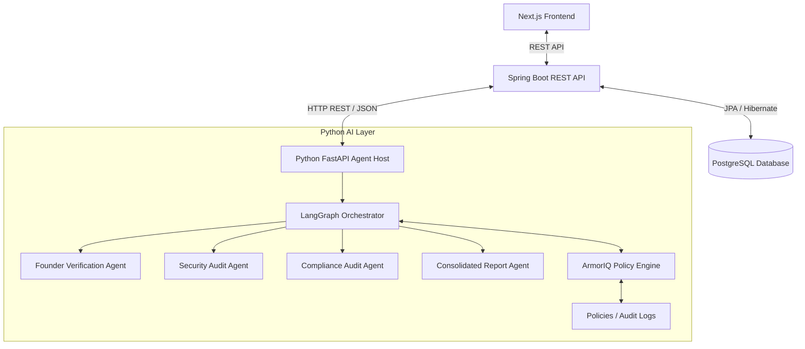

# VC Scout AI Security Agent

**VC Scout AI Security Agent** is a full-stack cybersecurity due-diligence platform designed for venture capital investors. It automates security risk checks, legal compliance auditing (GDPR, CCPA), and founder background verification using a multi-agent LangGraph system.

Every action, data fetch, and external trigger is intercepted and gated by **ArmorIQ Intent Assurance**, enforcing dynamic security and delegation policies in real-time.

---

## 🌌 Platform Architecture



### 1. Multi-Agent Pipeline (LangGraph)
*   **Founder Agent**: Cross-checks founder LinkedIn records for credentials, track record, and execution risks.
*   **Security Agent**: Scans the target domain and website presence for vulnerabilities, outdated UI libraries, and SSL certificates.
*   **Compliance Agent**: Evaluates Cookie Consent banners, Privacy Policies, and Terms of Service for GDPR/CCPA compliance.
*   **Report Agent**: Aggregates findings, computes individual and consolidated risk scores, and flags active security incidents.

### 2. ArmorIQ Policy Gating & Audit Logging
The custom **ArmorIQ Policy Engine** intercepts agent actions before they trigger LLM invocations or tool calls:
*   **Policy Gating**: Actions are audited against active policies (e.g. `BLOCK_HTTP_URL` to prevent scanning unsecured sites, `REQUIRE_FOUNDER_LINKEDIN` to enforce identity checks).
*   **Verdicts**: Evaluation results in an immediate **ALLOW**, **DENY** (blocked execution), or **DELEGATE** (sent for human approval) outcome.
*   **Audit Trail Sync**: All verdicts and execution flows are logged to a JSON-Lines audit log, which is dynamically synced by the Spring Boot backend into the system database for unified dashboards.

---

## 🛠️ Tech Stack & Prerequisites

*   **Frontend**: Next.js (App Router, Tailwind CSS, TypeScript)
*   **Backend**: Spring Boot 3.3.0, Spring Security 6, Spring Data JPA
*   **AI Layer**: Python 3.14, FastAPI, LangGraph, LangChain, OpenAI API
*   **Databases**: PostgreSQL (Production) / H2 in-memory (Fallback mode)

---

## 🚀 Execution and Setup Guide

### 1. AI Layer (Python FastAPI)
Navigate to the `VCScout` folder, create a virtual environment, and install dependencies.

```bash
# Navigate to AI folder
cd VCScout

# Install dependencies
py -m pip install -r requirements.txt

# Run the FastAPI server
py -m uvicorn main:app --reload --port 8000
```
*   The Python AI microservice will start on **`http://localhost:8000`**.
*   *Note*: The service automatically detects if `OPENAI_API_KEY` is present in your environment. If missing or rate-limited, it activates **Fallback Mock Mode** to provide realistic mock analyses and policy events without crashing, facilitating offline hackathon evaluation.

### 2. REST Backend (Spring Boot)
Navigate to the `backend` folder and run the bootstrapper script. It will automatically download a portable Maven installation inside the directory, compile the Java source, and start the application.

```powershell
# Navigate to backend folder
cd backend

# Execute run script (PowerShell)
./run.ps1
```
*   The Spring Boot server will run on **`http://localhost:8080`**.
*   *Prerequisite*: Java (JDK 17 or higher) must be installed.
*   *Database Fallback*: By default, the application connects to PostgreSQL on `localhost:5432/vcscout` (user: `postgres`/`postgres`). If PostgreSQL is offline, simply comment out the PostgreSQL properties in `src/main/resources/application.properties` and uncomment the H2 configuration to run in H2 in-memory database mode instantly!

### 3. Web Dashboard (Next.js)
Navigate to the `frontend` folder, install packages, and boot up the client dev server.

```bash
# Navigate to frontend folder
cd frontend

# Install UI packages
npm install

# Start Next.js Development Server
npm run dev
```
*   Open **`http://localhost:3000`** in your browser to access the interactive web interface!

---

## 🛡️ Hackathon Validation Walkthrough

1.  **Home Screen**: Access `http://localhost:3000` to view the cyber-neon dashboard splash. Click **Launch Security Console**.
2.  **Monitoring Console**: Under the *Evaluate New Target* card, trigger a startup check:
    *   *Stripe Check*: Try Name = `Stripe`, URL = `https://stripe.com`, LinkedIn = `https://linkedin.com/in/collison`. The ArmorIQ gate will **ALLOW** the execution. The multi-agent graph runs sequentially, creating detailed analysis tabs and checking off steps in the console.
    *   *Insecure Check (Policy Deny)*: Try Name = `Insecure Startup`, URL = `http://insecure-example.com` (note the `http://` instead of `https://`). The ArmorIQ gate will instantly enforce policy `POL_001` and output a **DENY** verdict, bypassing the scan and registering a critical incident alert.
    *   *Identity Missing (Policy Delegate)*: Try Name = `No Founder Corp`, URL = `https://test.com`, LinkedIn = (leave empty). The ArmorIQ gate enforces `POL_002` and outputs a **DELEGATE** verdict. An alert triggers in the IncidentResponse Feed.
3.  **Policy Editor**: Navigate to *Policy Control* (`http://localhost:3000/dashboard/policies`). Dynamically toggle policy toggles off (e.g. deactivate `POL_001`). Now try analyzing `http://insecure-example.com` again; the request will bypass the HTTPS block and evaluate normally! You can also register custom policies on the editor panel.
4.  **Audit Logs**: Access the *ArmorIQ Logs* tab (`http://localhost:3000/dashboard/logs`) to inspect the immutable ledger of all agent intent intercepts, target resources, policy triggers, and verdicts.
